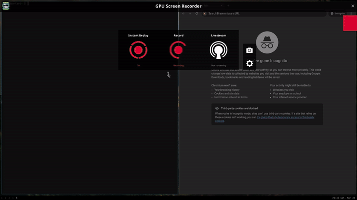

# zen(a)buser-bash

takes a screenshot, uploads it to a zendesk-based CDN, copies the URL to your clipboard.

(fork of [zenbuser](https://github.com/gur0v/zenbuser) written in bash.)



## dependencies

- [flameshot](https://flameshot.org/) or any other screenshot tool
- `curl`
- `xclip` / `xsel` / `wl-copy`
- `notify-send`
- `file`
- `xxd`
- `python3`
- `bash`

## installation

```sh
chmod +x ./zenbuser.sh
mv ./zenbuser.sh ~/.local/bin/zenbuser
mv ./zenvuser.toml ~/.config/zenbuser/zenbuser.toml
```

## usage

```
zenbuser [--version | -v] [--silent | -s]
```

bind it to a key in your compositor or WM and forget about it.

## configuration

config lives at `~/.config/zenbuser/zenbuser.toml`. see the example config in the repo for all options and comments.

## disclaimer

this tool uploads files to the public attachment endpoints of third-party support platforms. these aren't meant to be general-purpose file hosts, so don't spam them, don't upload anything illegal, and be reasonable about usage. your uploads may be removed at any time without notice. the author has no affiliation with zendesk or any of its customers, and is not responsible for whatever happens as a result of your use of this tool.

## license

public domain. see [UNLICENSE](UNLICENSE).
